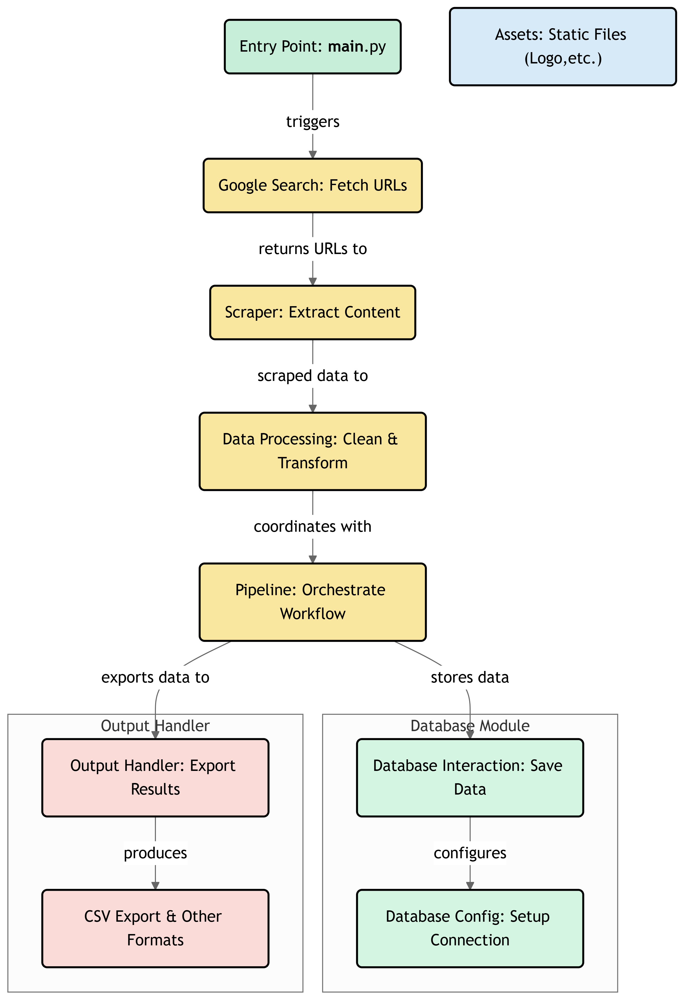

#                                                                                     Horse-Spider
Horse Spider is a Python-based project designed to perform Google searches, extract links from the search results, and scrape the content from those links. The project uses Selenium for simulating human-like interactions to avoid being flagged as a bot. The scraped data can be exported in multiple formats, such as CSV, JSON, and Excel.

## Authors

- [@Horsespider](https://github.com/Horsespider) played a significant role in this project. Her encouragement and help in picking the perfect name gave me the motivation and confidence to bring this idea to life. Without her support, this project might have remained just a thought. I'm deeply grateful for her inspiration and guidance.
- [@XenosWarlocks](https://www.github.com/XenosWarlocks) This project is a reflection of countless hours of coding, debugging, and learning. It's not just a tool—it's a piece of work that I'm proud of, and I hope it will be helpful to others looking to extract valuable insights from the web.


## Features

- Perform Google searches and extract URLs from the results.
- Handle pagination to scrape multiple pages.
- Simulate human interactions (e.g., delays, mouse movements) to avoid bot detection.
- Scrape content from the extracted URLs.
- Export the scraped data to CSV, JSON, or Excel.
- Store scraped data in a database.

## Installation

### Prerequisites

- Python 3.8 or higher
- Google Chrome (latest version)
- [ChromeDriver](https://sites.google.com/chromium.org/driver/) (compatible with your Chrome version)

### Setup

1. **Clone the repository**

   ```bash
   git clone https://github.com/your-username/Horse-Scraping.git
   cd Horse-Scraping
   ```

2. **Create and activate a virtual environment**
   ```bash
   python3 -m venv venv
   source venv/bin/activate  # On Windows: venv\Scripts\activate
   ```
   
3. **Install dependencies**
   ```bash
   pip install -r requirements.txt
   ```


### Usage
**Running the Scraper**
   ```bash
   python __main__.py
   ```

## WorkFlow




